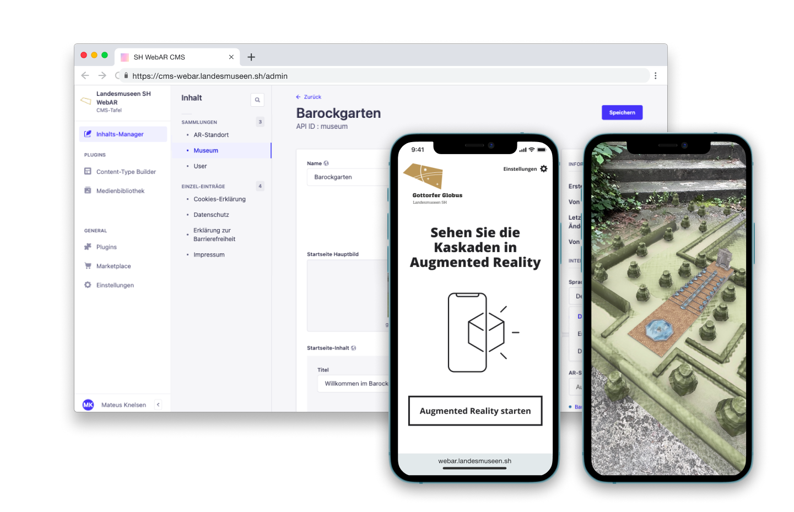
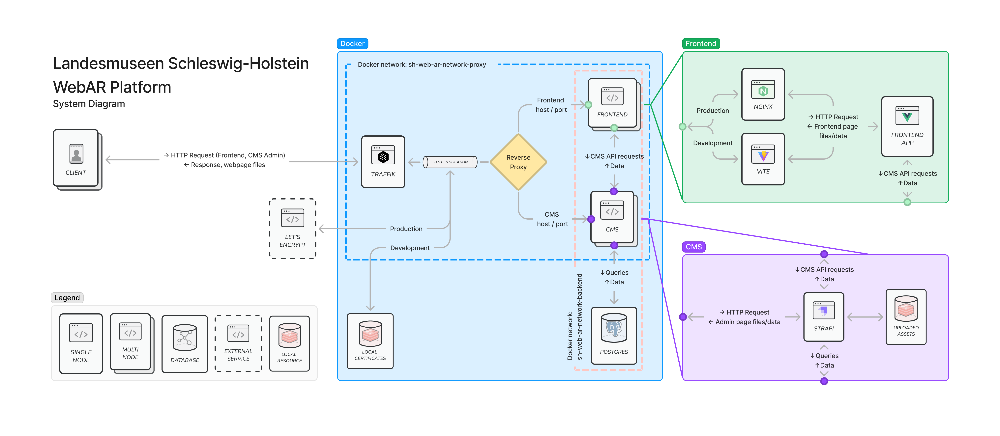

# Landesmuseen Schleswig-Holstein WebAR Platform



## Description

The [Landesmuseen Schleswig-Holstein WebAR](https://webar.landesmuseen.sh) allows visitors of [Schleswig-Holstein State Museums](https://landesmuseen.sh/) to access Augmented Reality (AR) scenes designed specifically for objects and locations of participating museums. The platform also allows for museums to easily input and edit content offered to visitors, giving contextual information about the AR scenes.

The platform was designed and developed by [NEEEU](https://neu.io) within the [museum4punkt0](https://www.museum4punkt0.de/) initiative in 2022.

## Components

This platform consists of two web applications: a frontend [SPA](https://en.wikipedia.org/wiki/Single-page_application) developed with [Vue 3](https://vuejs.org/) and [Vite](https://vitejs.dev/), and an CMS app based on [Strapi](https://strapi.io/). The CMS uses a [PostgreSQL](https://www.postgresql.org/) database.

The applications run within [Docker](https://www.docker.com/) containers. Reverse-proxying, production HTTPS/TLS certification and load balancing is done using [Traefik](https://github.com/traefik/traefik). Finally, the frontend SPA is served by a [Nginx](https://nginxproxymanager.com/) web server.

## System architecture

Below is a simple diagram of the system architecture of this project:



## Installation

1. Install [NodeJS](https://nodejs.org/en/download/) (v. 16 - LTS recommended) and [Docker Engine](https://docs.docker.com/get-docker/);

2. The apps are configured to run in HTTPS, also in the development environment. To run the HTTPS webservers properly in development, you will need to install local TLS certificates. [mkcert](https://github.com/FiloSottile/mkcert) is recommended to generate these certificates. Install it, create a folder named `certs` in the repository root folder, and then run the following command in the root folder:

  ```bash
  mkcert -cert-file certs/local-cert.pem -key-file certs/local-key.pem localhost
  ```

  Obs.: The exact parameters of the TLS certificate can vary depending on your development environment needs. For example, if you need to access the development environment running apps from a mobile device in the local network), you should include your development machine IP address in the above command. You could also include any localhost aliases (e.g.: `frontend.app.localhost`). See this [article](https://knplabs.com/en/blog/how-to-handle-https-with-docker-compose-and-mkcert-for-local-development) for more examples.

3. In order to run the containers, you will also need an environment variable file named `.env` at the root of the repository folder, containing the following variables:

  ```text
  #################### Frontend variables ##########################

  FRONTEND_APP_DEV_PORT= # The HTTP port the development environment frontend app should run on (ex. 80)

  FRONTEND_BASE_DEV_URL= # The URL of the development environment frontend app (ex. https://localhost)

  FRONTEND_APP_PROD_PORT= # The HTTP port the development environment frontend app should run on (port 80 recommended)

  FRONTEND_BASE_PROD_URL= # The base domain of the frontend production app (e.g.: https://webar.landesmuseen.sh)

  STRAPI_DEV_LOCAL_ASSETS_BASE_URL= # This should be the root domain of the local CMS app (e.g.: https://localhost:1337 or https://cms.app.localhost)

  STRAPI_DEV_REMOTE_ASSETS_BASE_URL= # This variable is used to properly resolve assets requests to Strapi from another device connected in the local network (i.e.: a mobile device accessing the frontend app running in the development machine). It should be set with the development machine IP address in the local network plus the port in which the CMS app is running in (e.g.: https://192.168.178.58:1337)

  STRAPI_PROD_ASSETS_BASE_URL= # The domain of the production CMS app (e.g.: https://cms-webar.landesmuseen.sh)

  API_DEV_URL= # The base URL for the development env. CMS app + '/api' (e.g.: https://cms.app.localhost/api)

  API_DEV_REMOTE_URL= # Also used to resolve local network requests. Should be set with the development machine IP address in the local network + the port the CMS app is running in + '/api' (e.g.: https://192.168.178.58:1337/api)

  API_PROD_URL= # The base URL for the production CMS app + '/api' (e.g.: https://webar-cms.landesmuseen.sh/api)

  STRAPI_DEV_AUTH_TOKEN= # The CMS API token to allow the frontend app to connect to Strapi. To generate one, follow these instructions: https://strapi.io/blog/a-beginners-guide-to-authentication-and-authorization-in-strapi

  STRAPI_PROD_AUTH_TOKEN= # The CMS API token to allow the frontend app to connect to Strapi. To generate one, follow these instructions: https://strapi.io/blog/a-beginners-guide-to-authentication-and-authorization-in-strapi

  ####################### CMS variables ############################

  JWT_SECRET= # A JSON Web Token Secret. Any random key with at least 24 characters should work.

  API_TOKEN_SALT= # A JSON Web Token Salt. Any random key with at least 24 characters should work.

  ADMIN_JWT_SECRET= # A JSON Web Token Secret. Any random key with at least 24 characters should work.

  APP_KEYS= # A list with 4 JWT keys. Should be comma separated (e.g.: KEY1,KEY2,KEY3,KEY4)

  CMS_HOST= # The CMS host IP address. Since the CMS app runs inside a Docker container, recommended IP is 0.0.0.0
  
  CMS_DEV_PORT= # The TCP port in which the development CMS app should run in. Recommended port is 1337

  CMS_PROD_PORT= # The TCP port in which the production CMS app should run in. Recommended port is 80

  CMS_DEV_URL= # The base domain of the development environment CMS app (e.g.: https://cms.app.localhost)

  CMS_PROD_URL= The base domain of the production CMS app (e.g.: https://cms-webar.landesmuseen.sh)

  DATABASE_NAME= # A name for the Strapi-dedicated database

  DATABASE_HOST=postgres # The database hostname, PostgreSQL uses 'postgres'

  DATABASE_PORT=5432 # The port in which the database runs in, PostgreSQL uses 5432

  DATABASE_USERNAME= # A name for the Strapi-dedicated database user 

  DATABASE_PASSWORD= # A password for the Strapi-dedicated database user

  DATABASE_SSL=false # This project is not configured for database SSL connection, so the recommended value here is 'false'

  #################### Database variables ##########################

  POSTGRES_DB= # A name for the dedicated database in PostgreSQL

  POSTGRES_USER= # The user name set above in 'DATABASE_USERNAME'

  POSTGRES_PASSWORD= #The password set above in 'DATABASE_PASSWORD'
  ```

4. Make sure ports set in the `.env` variables match what is set in the Dockerfiles for the CMS and frontend apps. In `cms/Dockerfile`, `cms/Dockerfile.dev`, `frontend/Dockerfile` and `frontend/Dockerfile.dev`, make sure the `EXPOSE` command has a matching port number according to what was set in `.env`.

5. Create the necessary Docker networks to allow the containers to communicate:

  ```bash
  docker network create sh-web-ar-network-backend
  docker network create sh-web-ar-network-proxy
  ```

## Running the applications

### Development environment

To run the development environment for the first time, build the Docker images:

```bash
docker compose up --build
```

Then later, if no Docker configuration is changed, you can run the development environment with the simple command:

```bash
docker compose up
```

Docker is configured to support hot-reloading from both apps build tools (Vite for the frontend app, Webpack for Strapi), so changes in the source code of both apps should be immediately applied to source files in Docker containers.

### Production environment

The production environment is configured in a distinct `docker-compose.production.yml` file. Therefore the run command is slightly different:

```bash
docker compose up -f docker-compose.production.yml --build
```

You can also run the containers in a decoupled process (the process runs in the background and does not terminate if the terminal session is closed), which is recommended in case if you are configuring your own deployment server:

```bash
docker compose up -f docker-compose.production.yml --build -d
```

## Further development

### Tooling

This project includes [ESLint](https://eslint.org/), [Prettier](https://prettier.io/) and [Stylelint](https://stylelint.io/) configuration files. These tools are strongly recommended to maintain code writing standards. You will need to install ESLint, Prettier and Stylelint plugins in your code editor ([Visual Studio Code](https://code.visualstudio.com) recommended) in order for this tooling to work.

We also recommend [Volar](https://github.com/johnsoncodehk/volar) plugin since it adds Vue 3 language features and improvements.

In case you are using VSCode, here is the recommended editor settings to run this project:

```json
// Editor code formatting configs
"editor.formatOnSave": true,
"editor.formatOnType": false,
"editor.formatOnPaste": false,
"editor.codeActionsOnSave": {
 //For ESLint
 "source.fixAll.eslint": true,
 //For TSlint
 "source.fixAll.tslint": true,
 //For Stylelint
 "source.fixAll.stylelint": true
},
"[javascript]": {
 "editor.defaultFormatter": "esbenp.prettier-vscode"
},
"[json]": {
 "editor.defaultFormatter": "esbenp.prettier-vscode"
},
"[vue]": {
 "editor.defaultFormatter": "esbenp.prettier-vscode"
},
"[css]": {
 "editor.defaultFormatter": "stylelint.vscode-stylelint"
},
"[html]": {
 "editor.defaultFormatter": "esbenp.prettier-vscode"
},

"javascript.updateImportsOnFileMove.enabled": "never",
"javascript.format.enable": true,
"javascript.validate.enable": true,

"emmet.syntaxProfiles": { "javascript": "jsx" },
"emmet.includeLanguages": {
 "javascript": "javascriptreact"
},

"eslint.alwaysShowStatus": true,
"eslint.workingDirectories": [{ "mode": "auto" }],
"eslint.options": {
 "extensions": [".html", ".js", ".vue", ".jsx"]
},
"eslint.probe": [
 "javascript",
 "javascriptreact",
 "typescript",
 "typescriptreact",
 "html",
 "vue",
 "markdown"
],
"eslint.validate": [
 "javascript",
 "javascriptreact",
 "typescript",
 "typescriptreact",
 "html",
 "vue"
],

"debug.javascript.debugByLinkOptions": "always",

"css.validate": false,
"less.validate": false,
"scss.validate": false,
"stylelint.enable": true,
"stylelint.validate": ["css", "sass", "vue"],
```

### Further details

Refer to the `README.md` files inside `/frontend` and `/cms` folders for details on the individual apps.

## Funding

This framework was developed as part of the project [museum4punkt0](https://www.museum4punkt0.de/) - Digital Strategies for the Museum of the Future. The project museum4punkt0 is funded by the Federal Government Commissioner for Culture and the Media in accordance with a resolution issued by the German Bundestag (Parliament of the Federal Republic of Germany).


## Credits

Contracting entity: [Landesmuseen Schleswig-Holstein](https://landesmuseen.sh)

Authorship, design and development: [NEEEU Spaces GmbH](https://neu.io)

## License

MIT License

Copyright © 2022 museum4punkt0 / Landesmuseen Schleswig-Holstein / NEEEU Spaces GmbH

Permission is hereby granted, free of charge, to any person obtaining a copy of this software and associated documentation files (the "Software"), to deal in the Software without restriction, including without limitation the rights to use, copy, modify, merge, publish, distribute, sublicense, and/or sell copies of the Software, and to permit persons to whom the Software is furnished to do so, subject to the following conditions:

The above copyright notice and this permission notice shall be included in all copies or substantial portions of the Software.

THE SOFTWARE IS PROVIDED "AS IS", WITHOUT WARRANTY OF ANY KIND, EXPRESS OR IMPLIED, INCLUDING BUT NOT LIMITED TO THE WARRANTIES OF MERCHANTABILITY, FITNESS FOR A PARTICULAR PURPOSE AND NONINFRINGEMENT. IN NO EVENT SHALL THE AUTHORS OR COPYRIGHT HOLDERS BE LIABLE FOR ANY CLAIM, DAMAGES OR OTHER LIABILITY, WHETHER IN AN ACTION OF CONTRACT, TORT OR OTHERWISE, ARISING FROM, OUT OF OR IN CONNECTION WITH THE SOFTWARE OR THE USE OR OTHER DEALINGS IN THE SOFTWARE.
